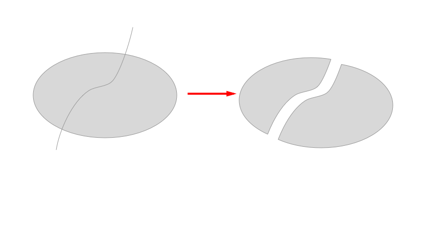

Divide Sketch Plugin
=============

### [DEPRECATED] This plugin doesn't support latest versions of Sketch and will not be maintained anymore

Plugins for [Sketch](https://www.sketchapp.com/) app

These plugins are for splitting shapes as shown in examples below.

#### **Update**

- Plugin got support of Sketch 4.0
- Pencil split is not available anymore. Besides that, Divide plugin has limited functionality. Just remember that Sketch cannot flatten shapes into multiple paths.

